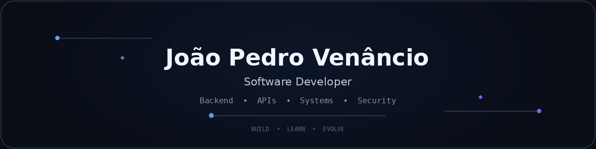
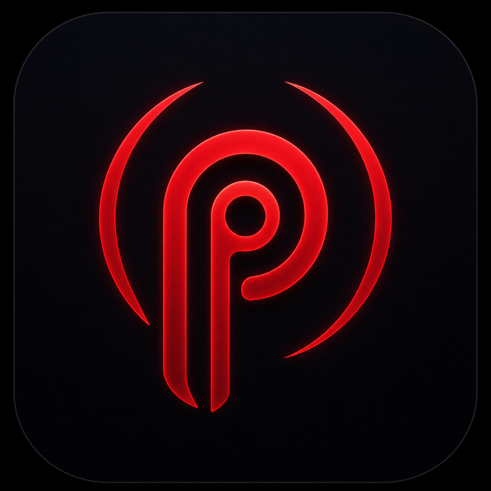

<div align="center">



</div>

<br>

## About

```text
profile@jprvenancio:~$ whoami
João Pedro Venâncio — Software Developer

profile@jprvenancio:~$ focus
Backend · APIs · Software Architecture · Application Security

profile@jprvenancio:~$ building
Orbit · Sentinel · Relay · Pulse · FinancePro

profile@jprvenancio:~$ philosophy
Understand → Build → Improve
```

<br>

## Tech Stack

<div align="center">

### Languages

&nbsp;&nbsp;
&nbsp;&nbsp;
&nbsp;&nbsp;
&nbsp;&nbsp;
&nbsp;&nbsp;


<br><br>

### Frameworks & Web

&nbsp;&nbsp;
&nbsp;&nbsp;
&nbsp;&nbsp;
&nbsp;&nbsp;
&nbsp;&nbsp;
&nbsp;&nbsp;


<br><br>

### Data & Cloud

&nbsp;&nbsp;
&nbsp;&nbsp;
&nbsp;&nbsp;
&nbsp;&nbsp;
&nbsp;&nbsp;


<br><br>

### Tools & Platforms

&nbsp;&nbsp;
&nbsp;&nbsp;
&nbsp;&nbsp;
&nbsp;&nbsp;


</div>

<br>

## Featured Projects

<table>
<tr>
<td width="50%" valign="top">

<div align="center">


### Portfolio

Portfólio pessoal para apresentar minha trajetória, projetos e evolução técnica.

`React` `JavaScript` `Tailwind`

<a href="https://github.com/JprVenancio/portfolio-joao-pedro">

</a>

</div>

</td>
<td width="50%" valign="top">

<div align="center">


### Orbit

Developer platform para criar, converter e modernizar aplicações.

`Automation` `Architecture` `Developer Tools`


</div>

</td>
</tr>

<tr>
<td width="50%" valign="top">

<div align="center">


### Sentinel

Plataforma voltada à segurança, análise e confiabilidade de aplicações.

`Security` `Analysis` `Systems`


</div>

</td>
<td width="50%" valign="top">

<div align="center">


### Relay

Integração e automação entre APIs, serviços e dados através de workflows.

`Integrations` `Workflows` `APIs`


</div>

</td>
</tr>

<tr>
<td width="50%" valign="top">

<div align="center">


### Pulse

Observabilidade, telemetria e visibilidade operacional para sistemas em execução.

`Observability` `Telemetry` `Monitoring`


</div>

</td>
<td width="50%" valign="top">

<div align="center">


### FinancePro

Gestão financeira com foco em organização, acompanhamento e clareza dos dados.

`Finance` `Backend` `Data`


</div>

</td>
</tr>
</table>

<br>

## Currently Building

<div align="center">

**Orbit** · **Sentinel** · **Relay** · **Pulse** · **FinancePro**

<sub>Explorando backend, integrações, arquitetura, segurança e observabilidade através de produtos próprios.</sub>

</div>

<br>

## Contact

<div align="center">

<a href="https://www.linkedin.com/in/jo%C3%A3o-pedro-rodrigues-venancio-688588235">
  
</a>
&nbsp;&nbsp;
<a href="https://portfolio-joao-pedro-three.vercel.app">
  
</a>
&nbsp;&nbsp;
<a href="mailto:Jprvenancio2304@gmail.com">
  
</a>

<br><br>

<sub>Building, learning and evolving — one project at a time.</sub>

</div>